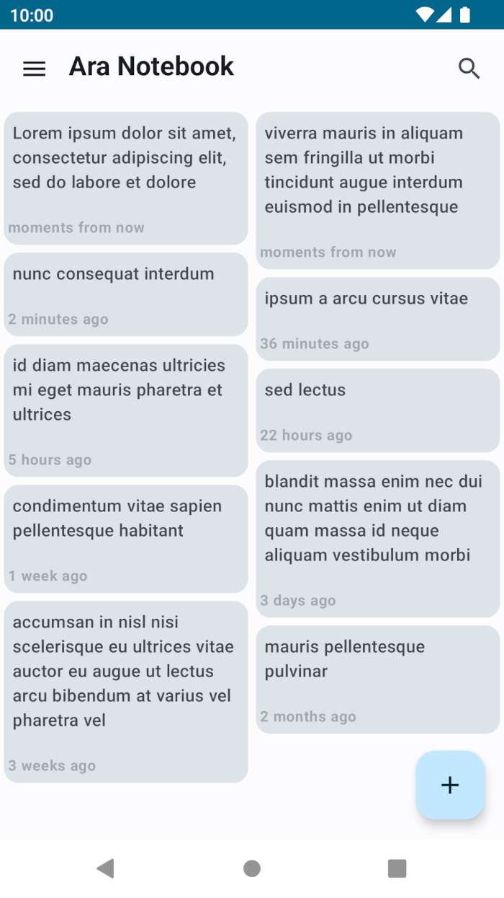
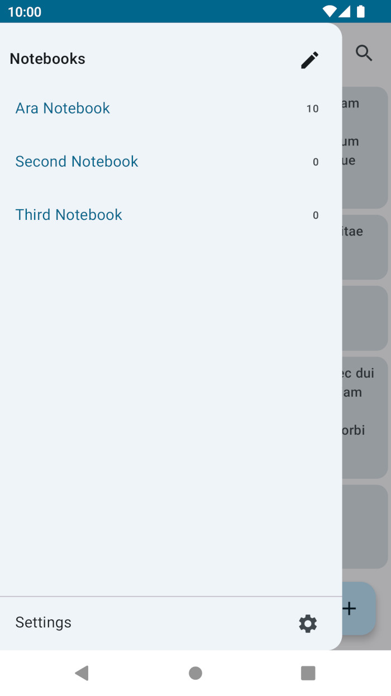
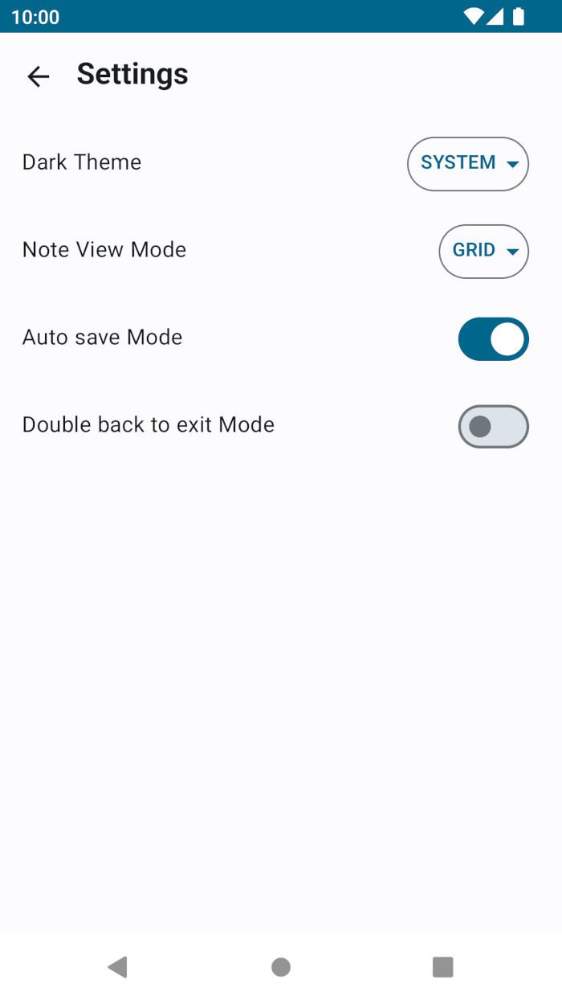
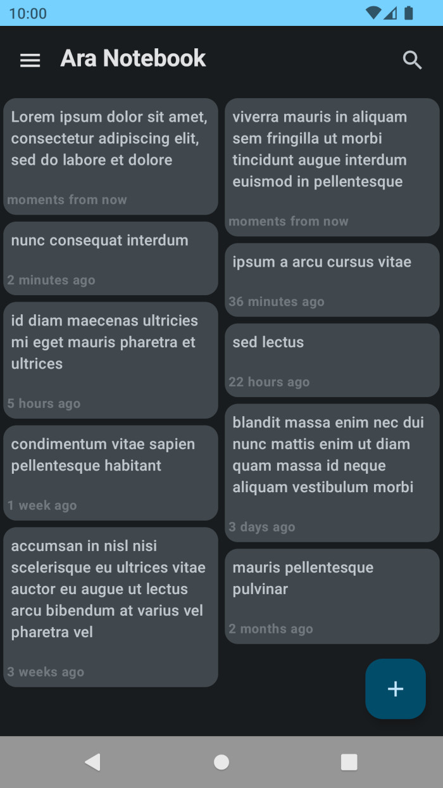
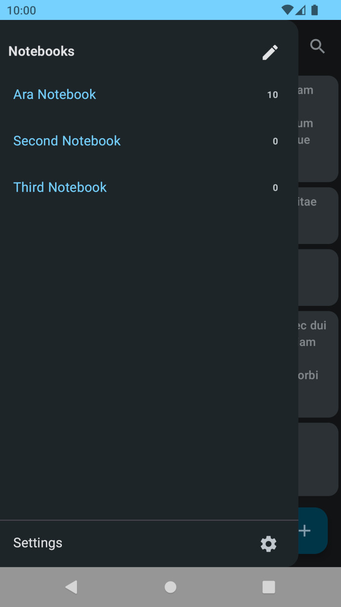

# Ara Note

A reliable note taking app

## Screenshots

## Directory structure

    .
    ├── app
    ├── core
    │   ├── alarm
    │   ├── backup
    │   ├── database
    │   ├── domain
    │   ├── entity
    │   ├── preference
    │   ├── repository
    │   ├── test
    │   ├── ui
    │   └── util
    ├── feature
    │   ├── home
    │   ├── navigation
    │   ├── notebookslist
    │   ├── notedetail
    │   └── settings
    └── gradle_plugin

## Technical point of view

* [Kotlin](https://kotlinlang.org/)
* Clean Architecture + [MVI](https://developer.android.com/topic/architecture)
* [Multi-Module Project](https://developer.android.com/topic/modularization)
* [Gradle Version Catalog](https://docs.gradle.org/current/userguide/platforms.html)
* Custom Gradle Plugins (in gradle_plugin directory)

* [Material 3](https://m3.material.io/) design system
* Declarative UI by [Jetpack Compose](https://developer.android.com/jetpack/compose)
* [Reactive programming](https://en.wikipedia.org/wiki/Reactive_programming) by [Kotlin Coroutines](https://github.com/Kotlin/kotlinx.coroutines) and [Flow](https://kotlinlang.org/docs/flow.html)
* [Dependency injection (DI)](https://en.wikipedia.org/wiki/Dependency_injection) by [Hilt](https://developer.android.com/training/dependency-injection/hilt-android)
* Data Persistence by [Room database](https://developer.android.com/training/data-storage/room/) and [DataStore](https://developer.android.com/topic/libraries/architecture/datastore)

* Unit Tests
* UI Tests
* [Page Object Models](https://www.selenium.dev/documentation/test_practices/encouraged/page_object_models/) for UI Tests
* [MockK](https://mockk.io/) mocking lib
* [kotlin.test](https://kotlinlang.org/api/latest/kotlin.test/) assertion lib
